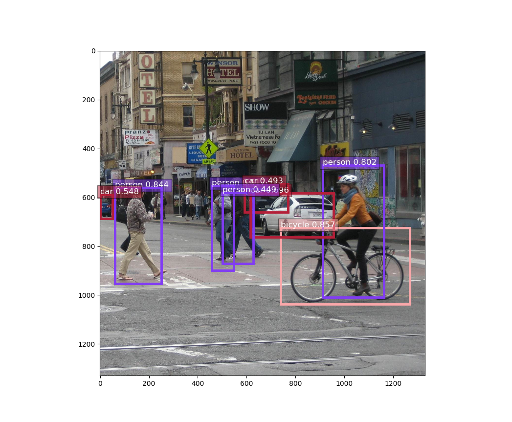
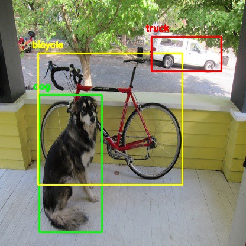
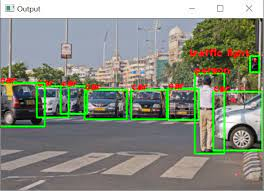

# Python YOLO Obje Tanıma
Bu Proje Bu Kaynaklardan Yola Çıkarak Yapılmıştır:<br>
https://pysource.com/2019/06/27/yolo-object-detection-using-opencv-with-python/<br>
https://www.youtube.com/watch?v=b59xfUZZqJE<br>
https://www.youtube.com/watch?v=p44G9_xCM4I<br>
https://github.com/zhreshold/mxnet-yolo<br>
# Kurulum:
```pip install opencv-python```<br>
```img/foto.jpeg``` Resimlerinize Göre Düzenleyin<br>
# Galeri:
<br>
<br>
<br>
<br>
# Yapanlar:
eminnesatgurses