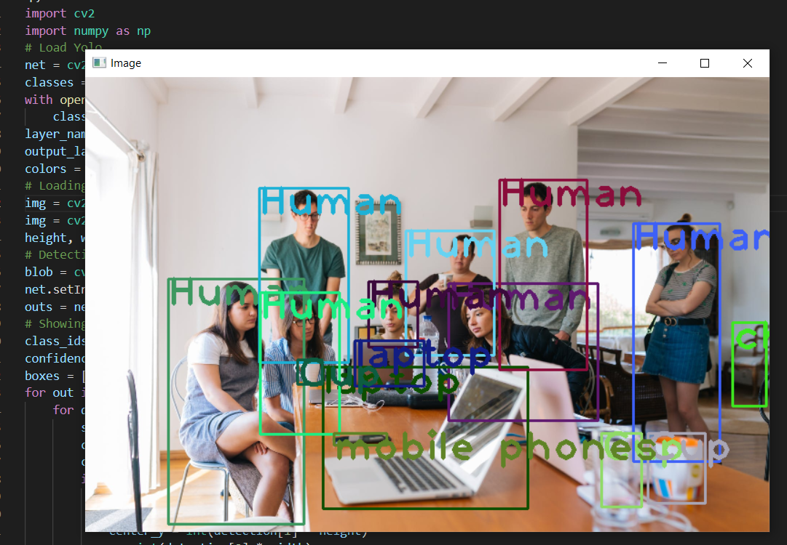

# Python YOLO Object Recognition
This Project Is Made From These Resources On The Road:<br>
https://pysource.com/2019/06/27/yolo-object-detection-using-opencv-with-python/<br>
https://www.youtube.com/watch?v=b59xfUZZqJE<br>
https://www.youtube.com/watch?v=p44G9_xCM4I<br>
https://github.com/zhreshold/mxnet-yolo<br>
# Setup:
```pip install opencv-python```<br>
```img/foto.jpeg``` Organize According to Your Images.<br>
https://pjreddie.com/media/files/yolov3.weights Download This File.<br>
# Gallery:
<br>
<br>
<br>
<br>

# Owner:
Peyxw
